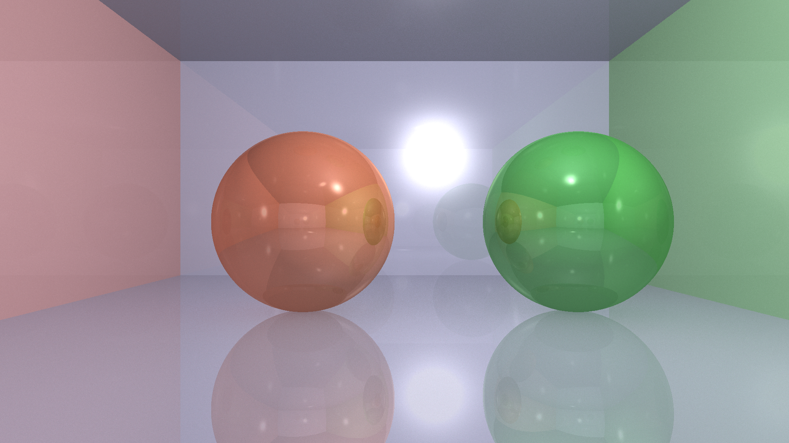

# Ray Tracer Project

## Overview

This is an ongoing project implementing a simple ray tracer in C++ using the Phong shading model and basic Monte Carlo global illumination. The current implementation supports spheres and planes with recursive reflections and diffuse lighting via hemisphere sampling.

The goal is to build a physically-based renderer with accurate light transport simulation.

## Current Features

- Ray-sphere and ray-plane intersection
- Phong shading model (ambient, diffuse, specular)
- Recursive reflections with adjustable reflectivity
- Monte Carlo sampling for diffuse indirect lighting (uniform hemisphere sampling)
- Multiple objects and a room constructed from planes
- Simple directional light source

## Current Render Result



## Planned Improvements

This project is actively under development. Upcoming features include:

- **Physically Based Rendering (PBR):** Implementing more realistic material models that adhere to physical principles.
- **Importance Sampling:** Improving efficiency of global illumination by sampling directions based on the BRDF.
- **Energy Conservation:** Ensuring that light interactions conserve energy for physically accurate results.
- **GPU Acceleration:** Porting ray tracing computations to run on GPU for significant performance improvements.

## Build & Run

The project uses [GLM](https://glm.g-truc.net/) for vector math. Compile with a C++17 compatible compiler.

```bash
g++ -std=c++17 -O3 -o raytracer main.cpp -lGLM
./raytracer
